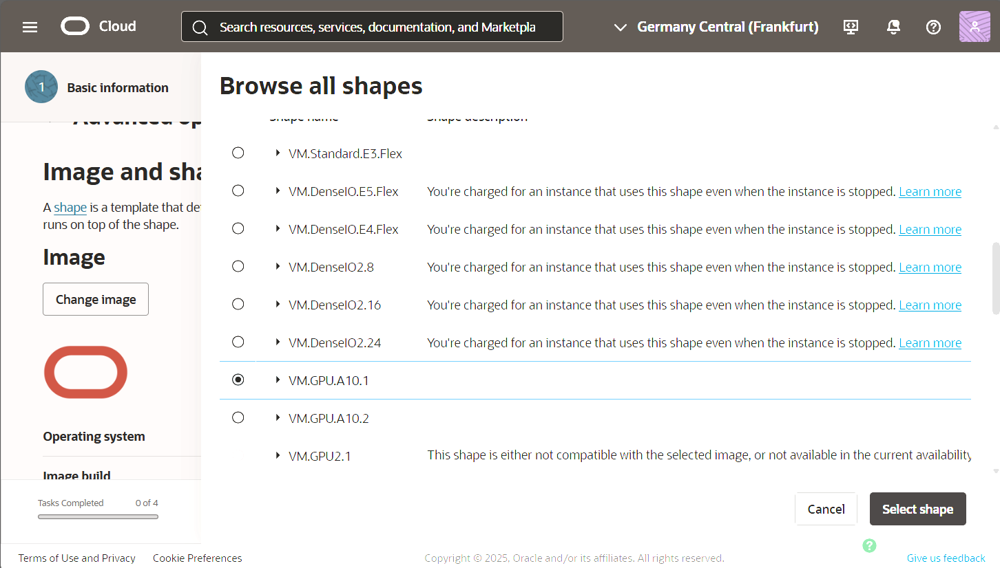
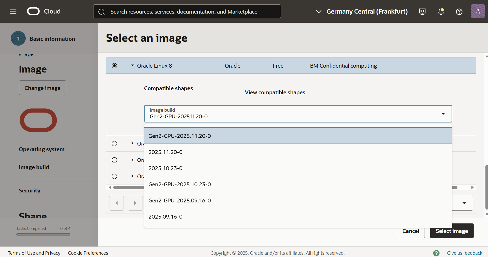
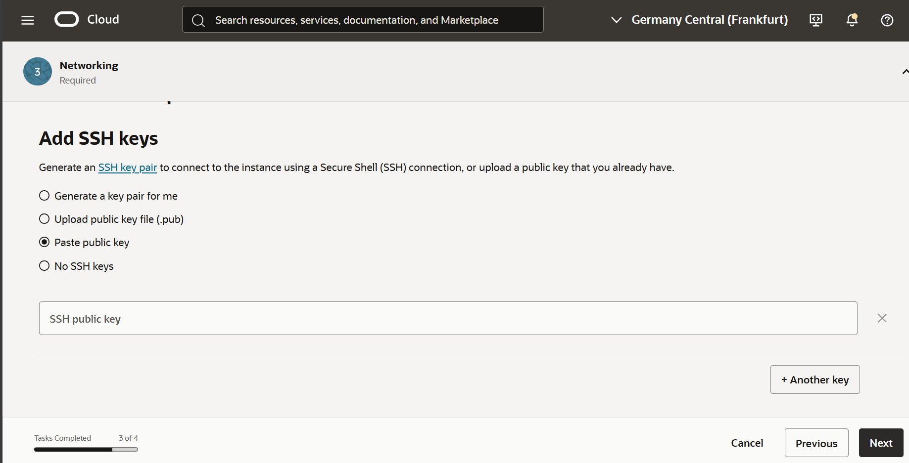

# Provision of NVIDIA Container

## Introduction

This lab will take you through the steps needed to provision NVIDIA container on oci instance with an A10 shape which has GPU,

Estimated Time: 45 minutes

### Objectives

Provisioning of NVIDIA container

### Prerequisites

This lab assumes you have:

* An Oracle account
* Administrator permissions or permissions to use the OCI Compute, Identity Domains, A10 shapes available.

## Task 1: Launch an A10 instance

1. Go to Compute -> Instance -> Create Instance. Under Image and Shape choose A10 shape as shown in the image below.

    

2. Click on Change Image and select the latest GPU version (one on the top) as Image Build under Oracle Linux 8. Shown in the image below.

    

3. Provide the information for **VCN**, **Subnet (It has to be Public)**, **Add SSH Keys (Add keys to access your instance)** and click **Create**.

    

## Task 2: Install NVIDIA container toolkit

1. In few minutes the status of recently created  instance will change from **Provisioning** to **Running**. 

2. Access the instance using the public ip of the instance with the following command:

    ```text
        <copy>
        ssh -i <ssh_key> opc@public_ip
        </copy>
    ```

5. Install NVIDIA-container-toolkit

    ```text
        <copy>
        curl -s -L https://NVIDIA.github.io/libNVIDIA-container/stable/rpm/NVIDIA-container-toolkit.repo | sudo tee /etc/yum.repos.d/NVIDIA-container-toolkit.repo
        </copy>
    ```

6. Run the following command

    ```text
        <copy>
        sudo yum install -y NVIDIA-container-toolkit
        </copy>
    ```

7. Generate CDI configuration for podman

    ```text
        <copy>
        sudo NVIDIA-ctk cdi generate --output=/etc/cdi/NVIDIA.yaml
        </copy>
    ```

8. Setup NVIDIA driver to be persistent across reboots

    ```text
        <copy>
        sudo NVIDIA-persistenced
        </copy>
    ```

9. Run the following command.

    ```text
        <copy>
        sudo systemctl enable NVIDIA-persistenced
        </copy>
    ```

10. Install podman

    ```text
        <copy>
        sudo dnf module install -y container-tools:ol8
        </copy>
    ```

9. Allow containers to use device files

    ```text
        <copy>
        sudo setsebool -P container_use_devices 1
        </copy>
    ```

    ```text
        <copy>
        sudo setsebool -P container_manage_cgroup on
        </copy>
    ```

## Task 3: Run NVIDIA cuOpt container

1. Run the cuopt image

    ```text
        <copy>
        sudo podman run --rm --device NVIDIA.com/gpu=all -p 8000:8000 -e CUOPT_SERVER_PORT=8000 docker.io/NVIDIA/cuopt:latest-cuda12.8-py3.12
        </copy>
    ```

## Task 4: Test cuOpt with an API call

Open a new SSH session with the following command (leave the previous one open so you will be able to see cuOpt logs):

```text
        <copy>
        ssh -i <ssh_key> opc@public_ip -L 8000:localhost:8000
        </copy>
```
```text
        <copy>
        curl --location 'http://localhost:8000/cuopt/request' \
        --header 'Content-Type: application/json' \
        --header 'Accept: application/json' \
        --data '{
            "cost_matrix_data": { "data": { "0": [[0, 1], [1, 0]] } },
            "task_data": {
            "task_locations": [1],
            "demand": [[1]],
            "task_time_windows": [[0, 10]],
            "service_times": [1]
            },
            "fleet_data": {
                "vehicle_locations": [[0, 0]],
                "capacities": [[2]],
                "vehicle_time_windows": [[0, 20]]
            },
            "solver_config": { "time_limit": 1 }
        }'
        </copy>
```


You will receive a reqId. Now run the following command, and you should see that the request has been completed:

```text
        <copy>
        curl --location 'http://localhost:8000/cuopt/result/YOUR_REQUEST_ID' \
        --header 'Accept: application/json'
        </copy>
```

## Task 5: Discover the cuOpt documentation

On your local machine, go to [http://localhost:8000/cuopt/docs](http://localhost:8000/cuopt/docs), where you can also run multiple tests.

## Acknowledgements

**Authors**

* **Guido Alejandro Ferreyra**, Principal Cloud Architect, NACIE

**Last Updated By/Date:**
* **Guido Alejandro Ferreyra**, Principal Cloud Architect, NACIE, December 2015
